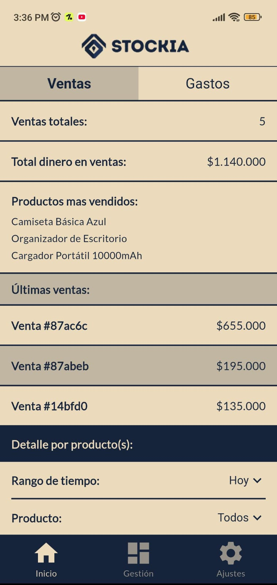
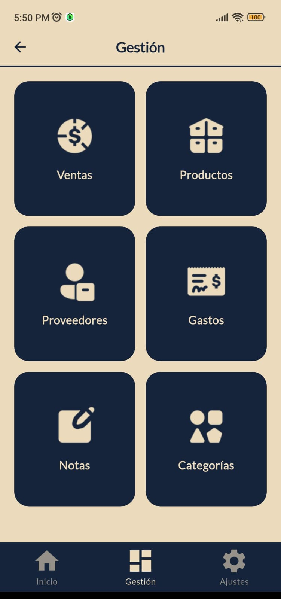

# Stockia - Sistema de Gestión de Inventario

<div align="center">
  
  
  <p>
    <strong>Aplicación móvil Full-Stack para control de emprendimientos y pequeños negocios.</strong>
  </p>
  
  <p>
    
    
    
    
  </p>
</div>

## 📱 Capturas de Pantalla

<div style="display:flex; justify-content:center; align-items:flex-start; gap:20px;">
    
    
</div>

## 📖 Descripción

Stockia es una aplicación móvil integral diseñada para emprendedores y pequeños empresarios que necesitan un control eficiente de su inventario, ventas y finanzas. La aplicación combina una interfaz intuitiva desarrollada en Flutter con un backend robusto en Node.js, ofreciendo una solución completa para la gestión empresarial.

### ✨ Características Principales

- **📦 Gestión de Productos**: CRUD completo con imágenes, categorías y control de stock
- **💰 Control de Ventas**: Registro automático con actualización de inventario en tiempo real
- **🏢 Gestión de Proveedores**: Información de contacto y categorización de proveedores
- **💸 Control de Gastos**: Seguimiento detallado de todos los gastos del negocio
- **📝 Sistema de Notas**: Recordatorios y notas importantes para el negocio
- **📊 Dashboard Analytics**: Reportes visuales de ventas y gastos con filtros por período
- **🔐 Autenticación Segura**: Sistema de login con JWT y persistencia de sesión

## 🏗️ Arquitectura del Proyecto

### Frontend (Flutter)
```
client/
├── lib/
│   ├── core/           # Configuraciones globales y utilidades
│   │   ├── api/        # Cliente HTTP con Dio
│   │   ├── constants/  # Colores, rutas y constantes
│   │   ├── theme/      # Tema de la aplicación
│   │   └── utils/      # Utilidades generales
│   ├── data/           # Capa de datos
│   │   ├── models/     # Modelos de datos
│   │   └── services/   # Servicios de API
│   ├── features/       # Módulos por funcionalidad
│   │   ├── auth/       # Autenticación
│   │   ├── products/   # Gestión de productos
│   │   ├── sales/      # Control de ventas
│   │   ├── dashboard/  # Panel principal
│   │   └── ...         # Otros módulos
│   └── shared/         # Widgets y componentes reutilizables
└── assets/             # Imágenes e iconos
```

### Backend (Node.js + TypeScript)
```
server/
├── src/
│   ├── controllers/    # Controladores de rutas
│   ├── services/       # Lógica de negocio
│   ├── models/         # Modelos de MongoDB
│   ├── middlewares/    # Middlewares personalizados
│   ├── routes/         # Definición de rutas
│   ├── types/          # Tipos de TypeScript
│   └── utils/          # Utilidades del servidor
├── tests/              # Tests unitarios e integración
└── docs/               # Documentación de API
```

## 🚀 Tecnologías Utilizadas

### Frontend
- **Flutter 3.x**: Framework de UI multiplataforma
- **Dart**: Lenguaje de programación
- **Dio**: Cliente HTTP con interceptores
- **SharedPreferences**: Persistencia local
- **Google Fonts**: Tipografías personalizadas
- **Image Picker**: Selección de imágenes
- **Material Design 3**: Sistema de diseño

### Backend
- **Node.js**: Runtime de JavaScript
- **TypeScript**: Tipado estático
- **Express.js**: Framework web
- **MongoDB**: Base de datos NoSQL
- **Mongoose**: ODM para MongoDB
- **JWT**: Autenticación con tokens
- **Bcrypt**: Cifrado de contraseñas
- **Vitest**: Framework de testing

## 📋 Prerrequisitos

### Para el Frontend
- Flutter SDK 3.x o superior
- Dart SDK 3.x o superior
- Android Studio / VS Code
- Dispositivo Android o emulador

### Para el Backend
- Node.js 18+ 
- npm o yarn
- MongoDB 6.0+
- TypeScript

## ⚙️ Instalación y Configuración

### 1. Clonar el Repositorio
```bash
git clone https://github.com/JuanesPachon/Stockia
cd stockia
```

### 2. Configurar Backend
```bash
cd server
npm install
```

Crear archivo `.env`:
```env
PORT=

DB_PASSWORD=
DB_CONNECTION_STRING=

JWT_SECRET=

NODE_ENV=

SUPABASE_URL=
SUPABASE_KEY=
```

### 3. Configurar Frontend
```bash
cd ../client
flutter pub get
```

## 🔧 Scripts Disponibles

### Backend
```bash
npm run dev          # Ejecutar en modo desarrollo
npm run build        # Compilar TypeScript
npm run start        # Ejecutar en producción
npm run test         # Ejecutar tests
npm run test:coverage # Tests con cobertura
```

### Frontend
```bash
flutter run          # Ejecutar en desarrollo
flutter build apk    # Generar APK
flutter test         # Ejecutar tests
flutter clean        # Limpiar cache
```

## 🧪 Testing

El proyecto incluye tests unitarios y de integración:

- **Backend**: 22 tests con Vitest
- **Frontend**: 11 tests unitarios con Flutter Test
- **Cobertura**: Funcionalidades principales del sistema

```bash
# Ejecutar todos los tests
cd server && npm run test
cd client && flutter test
```

## 📚 Documentación

- [Manual de Usuario](https://stockia-user-manual.netlify.app/) - Manual de uso para usuarios finales
- [Manual tecnico](https://stockia-technical-manual.netlify.app/) - Manual técnico de desarrollo

- [Documentación de Testing](https://stockia-testing.netlify.app/) - Guía de pruebas y testing

## 🔐 Seguridad

- Autenticación JWT con tokens seguros
- Contraseñas cifradas con bcrypt
- Validación de datos en frontend y backend
- Manejo seguro de cookies y sesiones
- Sanitización de inputs para prevenir inyecciones

## 🤝 Contribución

Las contribuciones son bienvenidas. Para contribuir:

1. Fork el proyecto
2. Crea una rama para tu feature (`git checkout -b feature/nueva-caracteristica`)
3. Commit tus cambios (`git commit -m 'Agregar nueva característica'`)
4. Push a la rama (`git push origin feature/nueva-caracteristica`)
5. Abre un Pull Request

## 📝 Licencia

Este proyecto está bajo la Licencia MIT.

## 👤 Autor

**Juan Esteban Pachón Ruiz**
- GitHub: [@tu-usuario](https://github.com/tu-usuario)
- LinkedIn: [Tu Perfil](https://linkedin.com/in/tu-perfil)
- Email: juanes.webdev@gmail.com

---

<div align="center">
  <p>⭐ Si te gusta este proyecto, no olvides darle una estrella ⭐</p>
</div>
